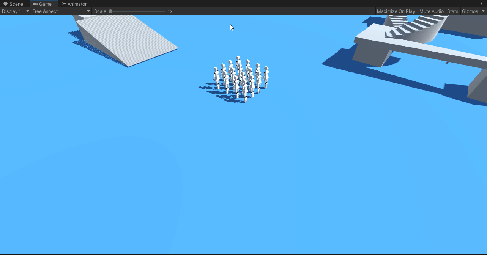

# What this is

Essentially it's a top down controller for Unity3D with movement you'd expect from a top down game/RTS/MOBA such as Diablo with camera controls from Cities Skylines. It's an asset that will hopefully be posted on the assetstore sometime soon.

# List of features

- Navmesh agent path finding,
- Command pattern based order queue,
- Enemy attack and NPC interact API exposed,
- Unit box selection,
- Control click selection,
- Group movement,
- Camera movement, rotation, zoom, world drag

# Preview

## Camera control

## Navmesh movement with order queue

## Multi character movement

